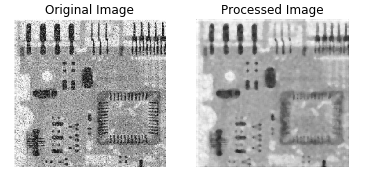
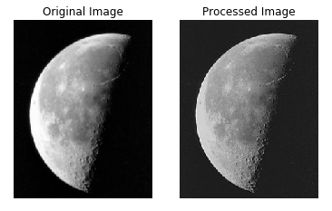
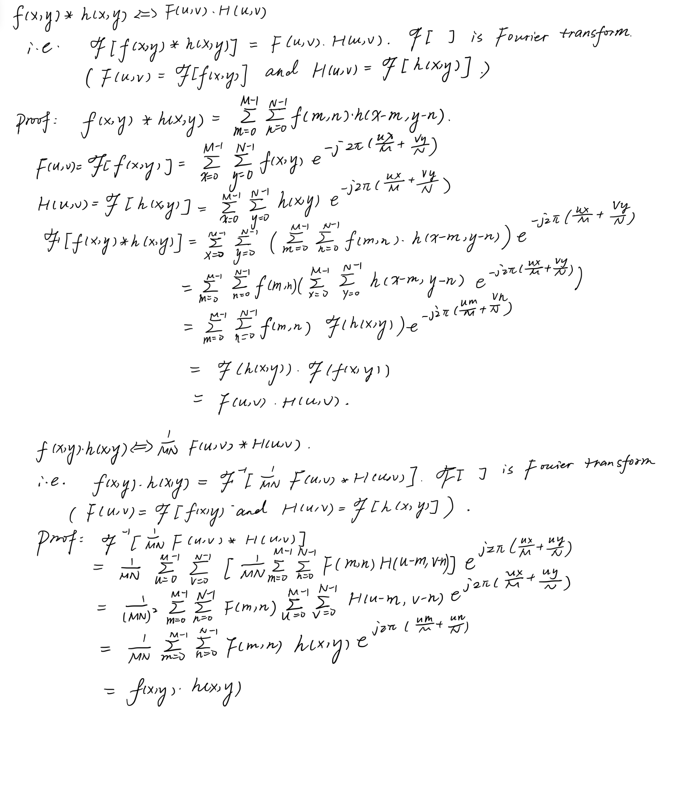
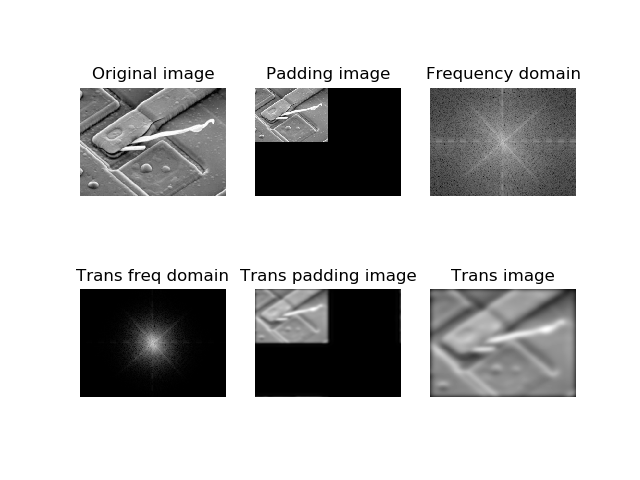
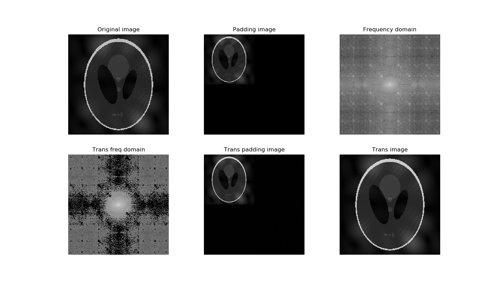
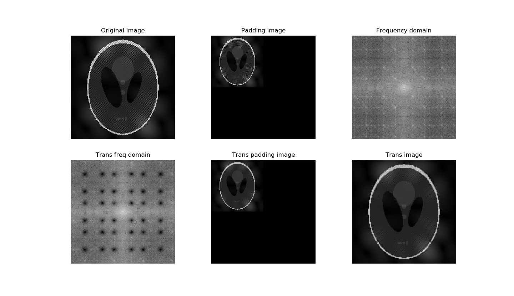

<!-- @import "[TOC]" {cmd="toc" depthFrom=1 depthTo=6 orderedList=false} -->

<!-- code_chunk_output -->

- [Image Processing Based on Filtering](#image-processing-based-on-filtering)
  - [1 Spatial Filter](#1-spatial-filter)
    - [1.1 Smoothing](#11-smoothing)
    - [1.2 Sharpening](#12-sharpening)
  - [2 Frequency Domain Filtering](#2-frequency-domain-filtering)
    - [2.1 Theory of frequency domain filtering](#21-theory-of-frequency-domain-filtering)
    - [2.2 Five steps of frequency filtering](#22-five-steps-of-frequency-filtering)
    - [2.3 Apply low-pass filter to a picture](#23-apply-low-pass-filter-to-a-picture)
    - [2.4 Get rid of the strips in the CT picture](#24-get-rid-of-the-strips-in-the-ct-picture)

<!-- /code_chunk_output -->

# Image Processing Based on Filtering

## 1 Spatial Filter
In this chapter, we are going to use spatial filter for smoothing and sharpening.
Since spatial filters use the same algorithm of updating the pixels using different kernels, we first implement the algorithm for updating the pixels.

### 1.1 Smoothing
I choose the order-statistics(median) kernel as the smoothing kernel.
Here is the result:

### 1.2 Sharpening
I choose the Laplacian kernel and normalize the gray-scale values to 0~255.

## 2 Frequency Domain Filtering

### 2.1 Theory of frequency domain filtering

f(x,y)*h(x,y) <=> F(u,v)H(u,v),    
f(x,y)h(x,y)  <=> F(u,v)*H(u,v),    
where * indicates convolution

Proof:

### 2.2 Five steps of frequency filtering
- Step 1: zero padding
- Step 2: turn image(f(x,y)) to frequency F(u,v)
- Step 3: apply H(u,v) to F(u,v)
- Step 4: turn F(u,v) to f(u,v)
- Step 5: remove zero padding

### 2.3 Apply low-pass filter to a picture
The result is shown below:

### 2.4 Get rid of the strips in the CT picture
To remove the strips in the picture, I choose the power filter to filter the peak of powers on the outer side of the spectrum domian.
The result is shown below:

Another method is to maually git rid of noise in frequency domian.
The result is shown below:

The two methods got similar result. 
