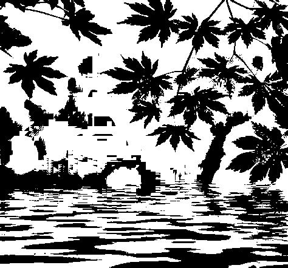

# Image processing

Implement some classical image processing algorithms

## binarization

### 1. global thresholding
<figure class="half">
    
    
</figure>

### 2. local thresholding
<figure class="half">
    
    
</figure>

By comparing the results of global thresholding and local thresholding, we found that local thresholding includes more *details*. The local size could not be too small, otherwise the picture will be full of local details and does not make sense globally.

## interpolation
<figure class="half">
    
    
</figure>
